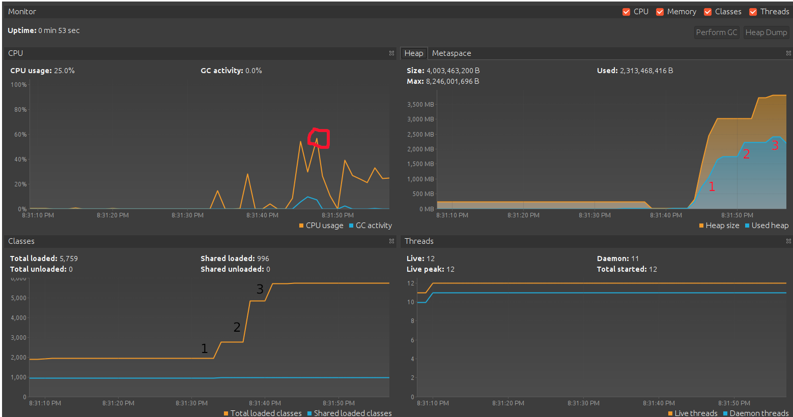
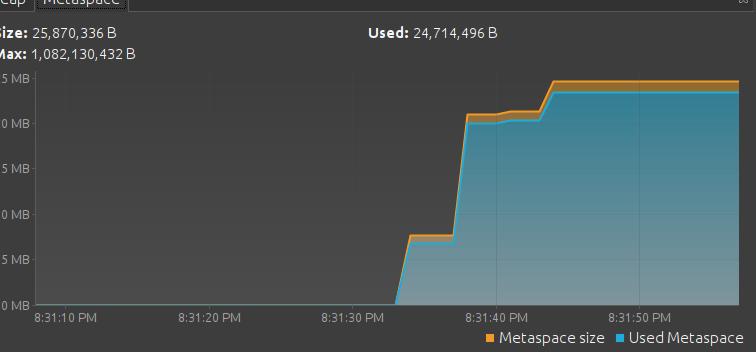

Домашнее задание для Netology.ru для курса Java Developer   

Описание и инструкция к выполнению [здесь](https://github.com/netology-code/jd-homeworks/tree/master/jvm/README.md)

Решение:

В блоке Classes мы видим скачки во время загрузки классов из пакетов. Номера на
скрине соответствуют порядку загрузки из пакетов:
1. в момент 20:31:32 - 20:31:33 - это произошло когда выполнялся метод: loadToMetaspaceAllFrom("io.vertx");
2. Далее наблюдаем второй скачок на графике, когда спустя 3 мс. выполнился второй метод: loadToMetaspaceAllFrom("io.netty").
3. Спустя 3 мс. 3-й скачок: началась загрузка классов с 3-го метода: loadToMetaspaceAllFrom("org.springframework")

В блоке CPU видим пик загрузки в 57% когда выполнялся метод createSimpleObjects(5_000_000_0) - создание 50 млн. объектов

На графике в блоке Heap мы видим, что произошел резкий скачек потребления памяти во время создания 50 млн. объектов (на графике (1)).

Следующие 2 скачка (на графике отмечены соответственно 2 и 3) произошли во время следующих созданий объектов с промежутком в 3 мс.

В блоке Metaspace каждый скачок на графике показывает занимаемую память во время загрузки классов.
(Описание по времени выше в блоке Classes)
 

